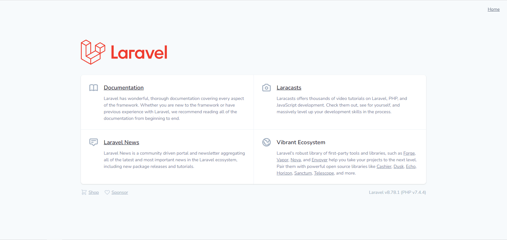
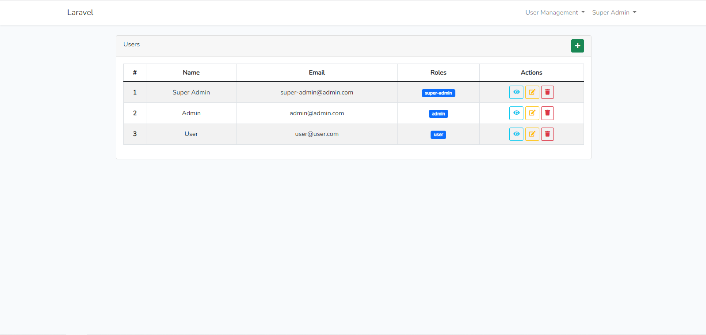
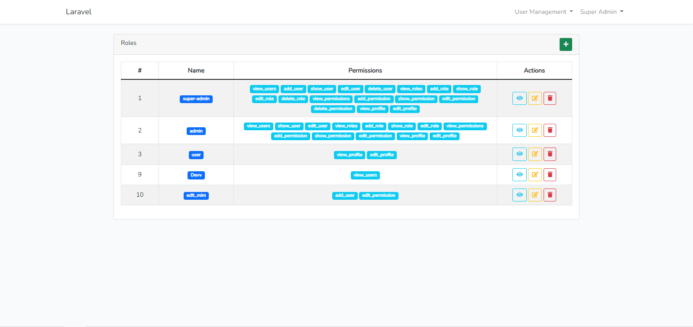
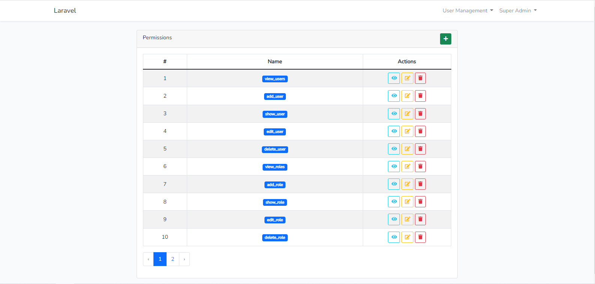

<p align="center"><a href="https://laravel.com" target="_blank"></a></p>

# Laravel Boilerplate Permissions
Laravel + Laravel UI + User Roles & Permissions

## Quick Start
- ```bash git clone git@github.com:MimisK13/laravel-starter.git```
- ```bash composer install```
- ```bash npm install && npm run dev```
- ```bash cp .env.example .env```
- ```bash php artisan key:generate```
- Create database
- ```bash artisan migrate --seed```
- ```bash php artisan serve```

```
Super Admin
- email: super-admin@admin.com
- password: password

Admin
- email: admin@admin.com
- password: password

User
- email: user@user.com
- password: password
```

<br />
<br />
<br />
<br />

## Contributing

## Code of Conduct
In order to ensure that the Laravel community is welcoming to all, please review and abide by the [Code of Conduct](https://laravel.com/docs/contributions#code-of-conduct).

## Security Vulnerabilities
If you discover a security vulnerability within Laravel, please send an e-mail to Taylor Otwell via [taylor@laravel.com](mailto:taylor@laravel.com). All security vulnerabilities will be promptly addressed.

## License
The Laravel framework is open-sourced software licensed under the [MIT license](https://opensource.org/licenses/MIT).
